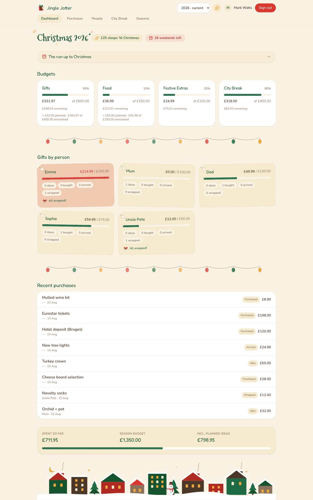
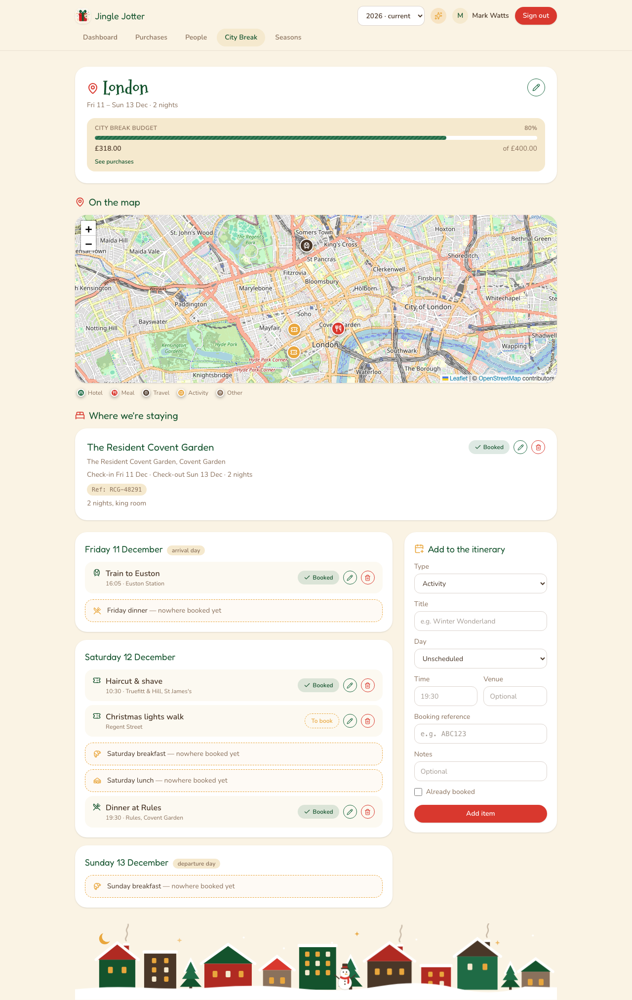
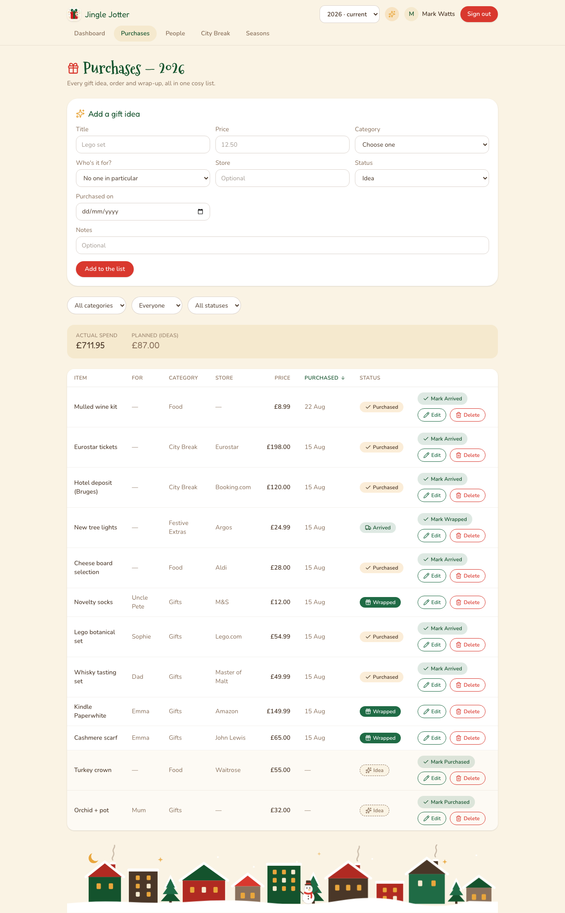
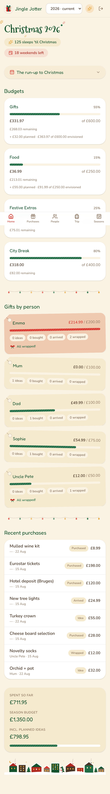

<p align="center">
  
</p>

<h1 align="center">Jingle Jotter</h1>

<p align="center"><em>A cosy, self-hosted Christmas budget &amp; gift tracker for your household.</em></p>

Jingle Jotter replaces the annual Christmas spreadsheet: one warm little web app
that tracks every gift idea from "maybe?" to wrapped-under-the-tree, keeps four
budgets honest (gifts, food, festive extras, and the December city break), and
rolls forward year after year so past Christmases become a browsable archive.

## Features

- **Purchase pipeline** — every item moves Idea → Purchased → Arrived → Wrapped,
  with one-tap advancing (and a little confetti burst when something gets wrapped).
  Ideas count toward a "planned" figure, never the actual spend.
- **Budgets that tell the truth** — four categories out of the box (add your own),
  each with progress bars, over-budget warnings, and planned-vs-actual totals.
- **Per-person gift tracking** — allocations per recipient, spend vs budget,
  status counts, and gift-tag-shaped cards that earn a bow when everything's wrapped.
- **Surprise-proof** — link a login to a person and gifts *for* them are masked
  from *their* account (title hidden, no edit access, their own summary card
  omitted) while still counting toward shared budgets. Plan your partner's gifts
  in the same app they use.
- **City break planner** — itinerary by day with automatic meal-gap detection
  (arrival-night dinner, full-day meals, departure breakfast), a dedicated hotel
  section with booking references, and an OpenStreetMap view with venues
  geocoded automatically from their names.
- **Seasons** — one active (writable) season; every past year is a read-only
  archive. Starting a new season copies people and budgets forward with a clean
  slate of purchases. People are global identities with per-season membership,
  so pruning this year's list can never damage last year's history.
- **The run-up calendar** — September to December at a glance, weekends tinted,
  Christmas days highlighted, days already gone snowed over with a "you are here"
  marker (plus sleeps-until-Christmas and shopping-weekends-left counters).
- **Gift idea bank** — a cross-year backlog per person ("spotted this in July"),
  promotable into the active season's list with one click. Ideas about *you*
  stay invisible to your login, naturally.
- **Delivery nudges** — expected-by dates on orders, due/overdue chips, and a
  "still in transit" dashboard card so nothing's stuck in a depot on the 23rd.
- **Christmas card list** — who gets a card, sent/received ticking, carried
  forward season to season. Postal addresses are encrypted at rest
  (AES-256-GCM, key outside the database — see Privacy below).
- **Season summary & exports** — a printable year-in-numbers recap, plus CSV
  exports of purchases and the card list. Year-over-year sublines on the
  dashboard once you have a second season.
- **Cosy by design** — hand-drawn snowy rooftops, fairy lights, and a festive
  display face… all behind a per-user whimsy switch for when you want it calm.
- Fully responsive: desktop tables, mobile cards and bottom-tab navigation.

## Screenshots

| Dashboard | City break planner |
| --- | --- |
|  |  |

| Purchases | Mobile |
| --- | --- |
|  |  |

## Stack

Next.js 16 (App Router, server actions) · React 19 · TypeScript · Tailwind CSS 4 ·
Prisma 7 on SQLite (`better-sqlite3` — no database server to run) · next-auth v5
with Google sign-in gated by an email allowlist · Leaflet + OpenStreetMap +
Nominatim for the trip map · Docker Compose for deployment.

## Self-hosting

The app is a single container; the SQLite database lives in a named volume and
migrations run automatically on boot.

```bash
git clone https://github.com/MarkRWatts/JingleJotter.git
cd JingleJotter
cp .env.docker.example .env.docker   # then edit: secrets + your allowed emails
docker compose up -d --build
```

Local dev instead: `npm install`, copy `.env.example` to `.env`, then
`npx prisma migrate dev`, `npx prisma db seed`, and `npm run dev`
(port 3003).

### Google sign-in

Create an OAuth client in the [Google Cloud console](https://console.cloud.google.com/)
(type "Web application") with redirect URIs for
`http://localhost:3003/api/auth/callback/google` and
`https://your-domain/api/auth/callback/google`, put the client ID/secret in your
env file, and list the Google account emails allowed to sign in as a
comma-separated `ALLOWED_EMAILS`. While the OAuth consent screen is in Testing
mode, add those same accounts as test users.

| Variable | Purpose |
| --- | --- |
| `AUTH_SECRET` | Session encryption — `openssl rand -base64 32` |
| `AUTH_GOOGLE_ID` / `AUTH_GOOGLE_SECRET` | The OAuth client above |
| `ALLOWED_EMAILS` | Comma-separated allowlist of Google accounts |
| `AUTH_URL` | The app's canonical external URL |
| `DATABASE_URL` | SQLite path (defaulted in compose to the data volume) |
| `PII_ENCRYPTION_KEY` | Address encryption — `openssl rand -base64 32` |

Reverse-proxy TLS, backups (the database is one file — archive the volume), and
DNS are yours to taste; any HTTPS-terminating proxy in front of port 3000 works.

## Privacy & your data

The in-app [privacy notice](app/privacy/page.tsx) (served at `/privacy`) is the
summary of the app's data-handling posture. The short version:

- **Minimal by design** — names, gift/budget details, and (only if you use the
  card list) card recipients' names and postal addresses. Nothing else about
  anyone.
- **Addresses are encrypted at rest** — AES-256-GCM via `PII_ENCRYPTION_KEY`,
  which lives only in your env file: the SQLite file and its backups alone can't
  reveal an address. Losing the key loses stored addresses (only) — keep it
  safe, keep it out of git.
- **Nothing phones home** — no analytics, no third-party storage. The only
  outbound calls are Google sign-in and OpenStreetMap lookups of trip *venue*
  names; personal addresses are never geocoded and never appear in URLs or logs.
- **Erasure & portability** — contacts and their addresses hard-delete in-app,
  and each season's purchases and card list export as CSV.

One household running this for itself sits under GDPR's household exemption;
the above is good practice regardless, and a starting point if you host it for
anyone beyond your own kitchen table.

## License

[GPL-3.0-or-later](LICENSE). Built with care (and a considerable quantity of
mulled wine metaphors) for one household's Decembers — shared in case it makes
yours merrier too.
